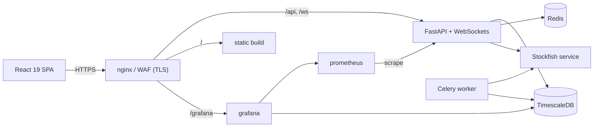

# ♞ Shantranj — Chess Training Platform

A production-grade chess improvement platform: a gated, hand-verified learning path;
real-time online play; bot games with a five-level live coach; head-to-head puzzle duels;
friends, presence and challenges; achievements and XP — all behind a full observability
stack that treats every game as a **telemetry stream**.

Built solo as a portfolio piece, deliberately on the stack I'm mastering on my DevOps
internship (Python/FastAPI + TimescaleDB + Grafana), applied to a different domain.

> Status: feature-complete across phases 0–9. Backend 60 tests, engine 6 real-Stockfish
> tests, frontend unit + Playwright e2e — all green in CI. See [PROGRESS.md](PROGRESS.md).

## The telemetry throughline

The reason this stack: my internship homelab ingests **automotive telemetry** into TimescaleDB
and visualises it in Grafana. This app applies the exact same pipeline to chess — moves,
clocks, engine evals, rating changes and XP flow into **TimescaleDB hypertables** (with
compression, retention and continuous aggregates) and surface in a **Grafana dashboard beside
the Prometheus infra metrics**. Same patterns, different domain.

## Features

- **Learn** — 12-stage path (board vision → tactics → openings → endgames → strategy →
  calculation → attack/defense → practical play → capstone), gated so you finish one item to
  unlock the next, each stage ending in a **boss checkpoint** vs a bot with a verified
  objective. Content is DB-driven behind an **admin Content Studio** with a python-chess
  validator that refuses to publish illegal positions.
- **Play** — four modes: **Online** (human vs human, server-authoritative, Elo, no live help),
  **Learn-by-Playing** (bot + a coach with 5 assistance levels L1→L5), **Bot Arena**
  (8 Stockfish levels, no help, ladder Elo), and **Puzzle Duel** (real-time head-to-head
  tactics race with combo scoring). All with configurable time controls.
- **Review** — post-game analysis via Celery + Stockfish (per-move tags + lichess-style accuracy).
- **Social** — friends, live presence, friend challenges, and per-mode leaderboards.
- **Progress** — XP, levels, daily streaks, ~40 achievements, and a profile with rating graphs.

## Architecture



| Layer | Tech |
|---|---|
| Backend | Python 3.12 · FastAPI (async) · SQLAlchemy 2.0 + Alembic · Pydantic v2 · Celery |
| Data | TimescaleDB (Postgres 16 + hypertables/caggs) · Redis 7 |
| Realtime | FastAPI WebSockets (/ws/game, /ws/social, /ws/duel) |
| Chess | python-chess (server-authoritative) · Stockfish in its own container |
| Frontend | React 19 · Vite · TypeScript · Tailwind 4 |
| Infra | Docker Compose (dev/prod) · NGINX + ModSecurity CRS · GitHub Actions |
| Observability | Prometheus · Grafana (infra + game telemetry) |
| Tooling | uv · Ruff · mypy (strict) · pytest + testcontainers · Vitest · Playwright |

## Quick start (dev)

Requires Docker (Compose v2) and GNU Make.

```bash
make up                       # full stack → http://localhost:8080
make migrate && make seed     # schema + curriculum/puzzles/achievements + demo users
make test                     # backend + engine + frontend suites
make e2e                      # Playwright happy-path smoke
```

Entry points: app `:8080` · API docs `:8000/docs` · Grafana `:3001` (admin/admin) ·
Prometheus `:9090` · Adminer `:8081`. Demo login: `magnus_dev` / `Passw0rd1`
(admin: `admin` / `Passw0rd1`).

Production stack, TLS/backup/deploy: see [docs/RUNBOOK.md](docs/RUNBOOK.md).

## Repository layout

```
frontend/   React SPA (+ e2e/ Playwright)      backend/   FastAPI API + Celery worker
engine/     Stockfish UCI service              devops/    compose, Dockerfiles, monitoring, loadtest
docs/       plan · architecture · tasks · curriculum · runbook · security
legacy-v1/  the original static lesson app (design + content seed)
```

Docs: [PLAN](docs/PLAN.md) · [ARCHITECTURE](docs/ARCHITECTURE.md) · [TASKS](docs/TASKS.md) ·
[CURRICULUM](docs/CURRICULUM.md) · [RUNBOOK](docs/RUNBOOK.md) · [SECURITY](docs/SECURITY.md)

## What I'd do next

- Bulk-import the Lichess puzzle DB (CC0) to widen the duel pool beyond the seeded set.
- Redis-back presence/matchmaking + the socket layer for horizontal scale (in-process today).
- Author the remaining curriculum content through the Content Studio to fill every stage.
- Profile accuracy-trend + opening stats from the `player_accuracy_weekly` cagg and PGN data.
- Spectator mode and game chat.

## License

[MIT](LICENSE).
